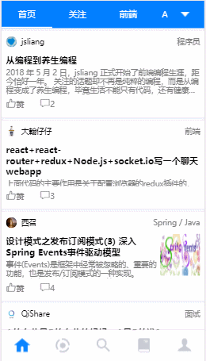
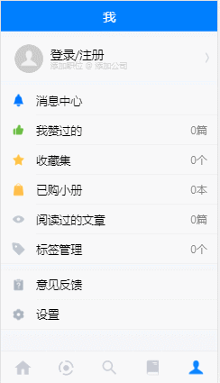
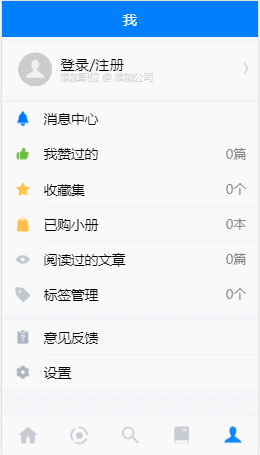
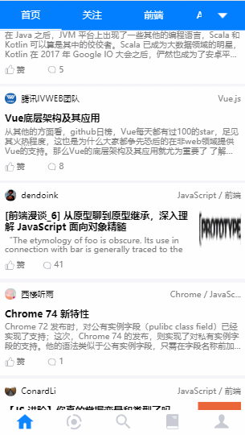
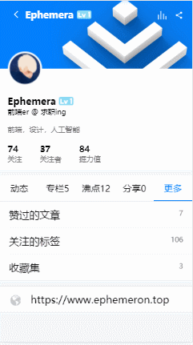
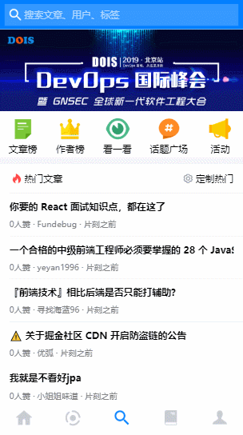

#### 介绍

持续更新中...  
这个项目是一边学 React 一边做的，项目的一些代码可能后面要继续优化  
因为 webapp 和原生客户端还是有一些差别，一些 UI 可能没有完全还原，等这个做完后面应该会学一下 RN 再进行改版

#### 掘金主页

[偶尔掉落博客](https://juejin.im/user/5bc472bcf265da0aac700838/posts)

#### 启动

```bash
# 安装
yarn install
# 启动数据端口
npm run dev:server
# 启动前端
npm run start
```
#### 已完成
- 首页列表展示 √
- 沸点列表展示 √
- 小册列表展示 √
- 用户个人页面及其他用户页面 √
- 客服回复 √
- 搜索 ×
- 分享 ×
- 首页及沸点展示标签 √
- 文章详情页 √
- 沸点详情页 √
- 话题页面 √
- 评论功能 ×
- 登录/鉴权/退出登录 √
- 注册 ×
- 用户关注 √
- 用户喜欢 ×
- 小册购买 ×


#### [部分效果展示](<(https://github.com/SusieChang/react-app/tree/master./doc/%E6%95%88%E6%9E%9C%E5%9B%BE)>)

<table width="100%">
    <tr>
        <td width="33%" height="100%">
            
        </td>
        <td width="33%" height="100%">
            
        </td>
        <td width="33%" height="100%">
            
        </td>
    <tr>
        <td width="33%" height="100%">
            
        </td>
        <td width="33%" height="100%">
            
        </td>
        <td width="33%" height="100%">
            
        </td>
    </tr>
    <tr>
        <td width="33%" height="100%">
            
        </td>
        <td width="33%" height="100%">
            
        </td>
    </tr>
</table>

---

一些后端接口部分参考了[这个作者](https://github.com/Kim09AI/react-juejin/blob/master/server/config/index.js)
